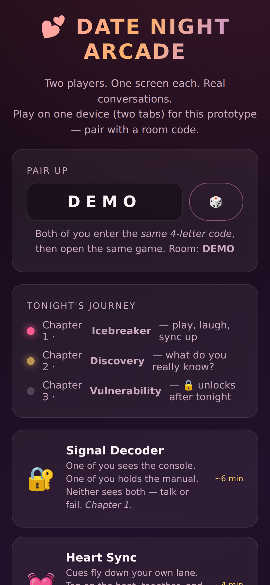
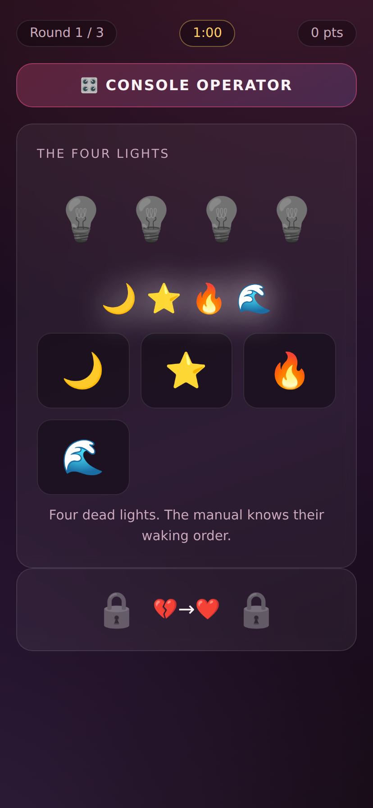
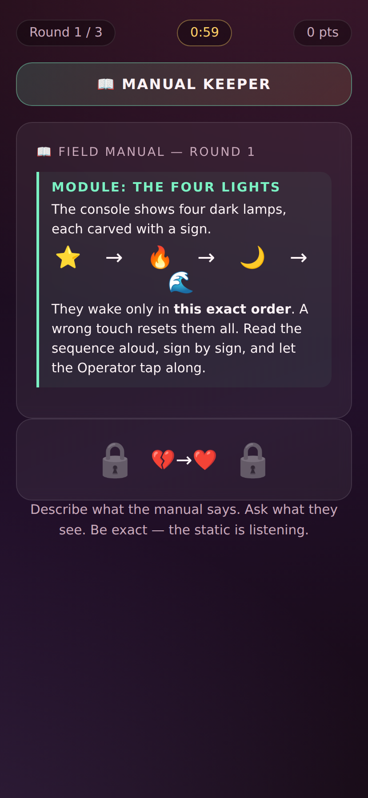
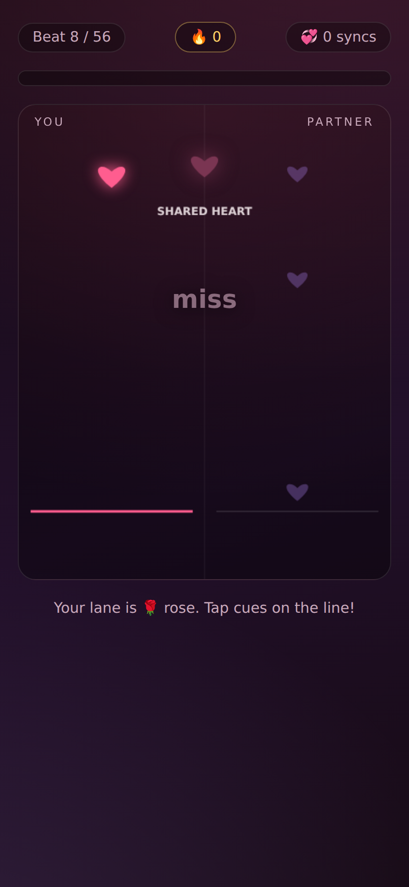
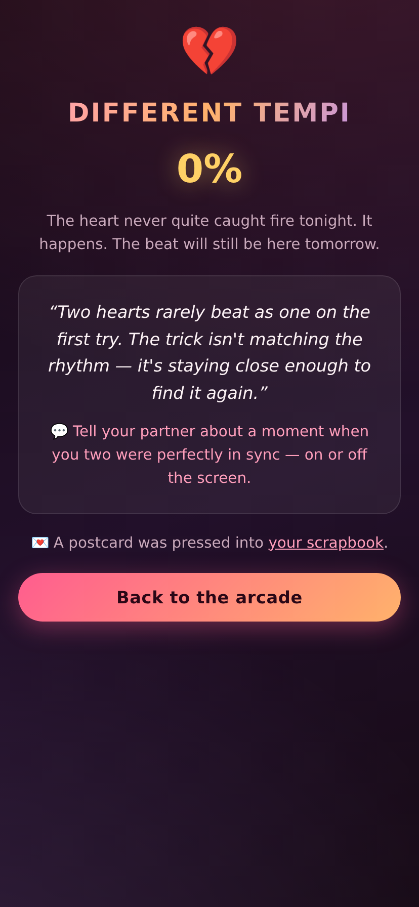
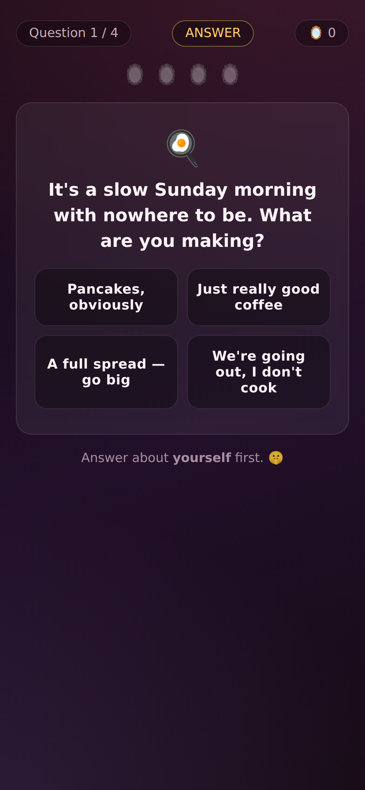
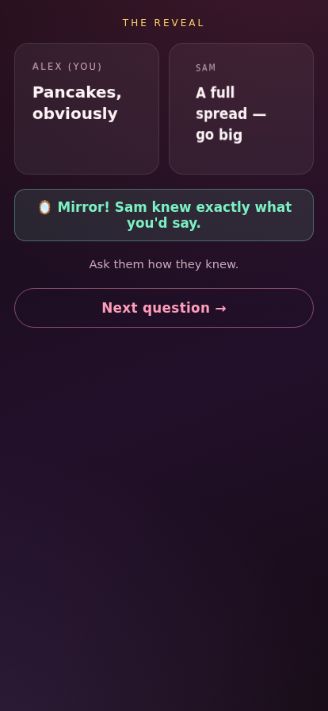
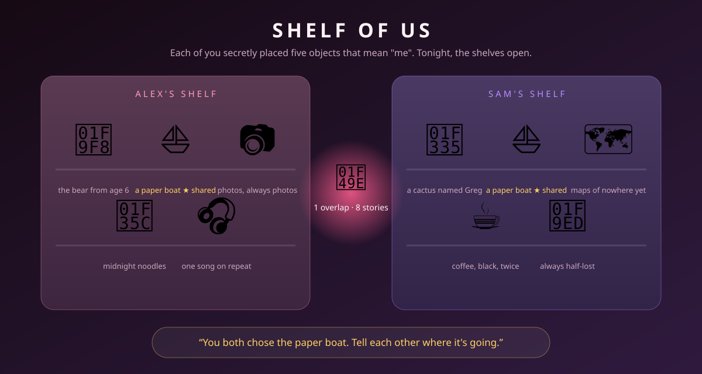
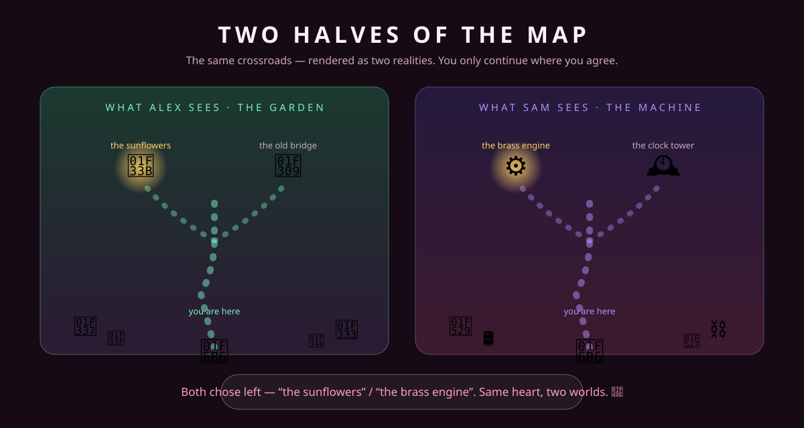

# 💕 Date Night Arcade — Plan & Prototypes

A browser-based, two-player **date-night game collection**: two people, each on their
own screen, collaborating in real time — solving puzzles, playing together, and
learning about each other.

This document is the concrete follow-up to the research synthesis: it describes the
product shape, the full game roster, and the three **playable prototypes** shipped in
this repository, with visuals of each.

---

## 1. Product shape

> **An asymmetric minigame anthology with a light 3-chapter story frame.**

- **Two screens, one room.** Players pair with a 4-letter room code and play the same
  session from their own screen. Most games show each player *different* information —
  talking is the core mechanic.
- **Session ≈ 20 minutes.** 3–5 minigames and questions, with natural pause points
  every 3–5 minutes. Resumable; Chapter 3 unlocks on a later date.
- **Escalating intimacy, structurally gated.** Chapter 1 *Icebreaker* → Chapter 2
  *Discovery* → Chapter 3 *Vulnerability*. Depth cannot be skipped into.
- **Score the minigames, never the conversations.** Competitive scoring and
  vulnerability are incompatible by design.
- **A persistent scrapbook.** Every finished game presses a postcard artifact into a
  shared scrapbook, so the game becomes a relationship artifact rather than a
  disposable one-night experience.



---

## 2. Architecture

### Prototype (this repository)

| Layer | Choice | Why |
|---|---|---|
| Pairing | 4-letter room code, stored in `localStorage` | Zero setup, demoable anywhere |
| Transport | `BroadcastChannel` + `localStorage` relay (`js/pairing.js`) | Real two-player sync between two tabs/windows on one device — no server needed |
| Lock-step sync | `DN.lockStep()` promise primitive | Both-secret-then-simultaneous-reveal mechanics (answers, consent gates) |
| Rendering | Hand-rolled CSS + one canvas (Heart Sync) | No build step, no dependencies, loads instantly on any phone browser |
| Audio | Tiny WebAudio synth (Heart Sync) | No audio assets to host; unlocked on first tap |

### Production path (planned)

The prototype's transport is deliberately isolated behind one function
(`openChannel`). To ship for two phones over the internet:

1. Swap `openChannel` for a **WebSocket relay** (Partykit on Cloudflare Workers or
   Socket.io) keyed by the same room codes. Every other API (`joinRoom`, `lockStep`,
   event names) stays identical.
2. Add **QR-code + `navigator.share()` invites** (`/join?room=XXXX`) for pairing.
3. Server-authoritative state snapshots so an iOS-backgrounded tab (WebSockets die
   ~30 s after backgrounding) can resync instantly.
4. PWA manifest + service worker: installable, full-screen, wake-lock during play.

### File map

```
.
├── index.html                  # Arcade landing: room pairing, chapter map, game list, scrapbook
├── css/main.css                # Shared "dark romantic" theme + shared components
├── js/pairing.js               # Room codes, presence, lock-step, scrapbook store
├── games/
│   ├── signal-decoder/         # 🔐 Prototype 1 — asymmetric info puzzle
│   ├── heart-sync/             # 💓 Prototype 2 — co-op rhythm
│   └── mirror-round/           # 🪞 Prototype 3 — predict & reveal + Simultaneous Draw
├── docs/mockups/               # SVG concept art for games not yet prototyped
└── screenshots/                # Captured gameplay visuals (used below)
```

---

## 3. The game roster

Each game names its research inspiration and the beat it plays in the evening.
**Bold** = playable prototype in this repo.

### Chapter 1 · Icebreaker — *play first, talk always*

#### 🔐 Signal Decoder — **PROTOTYPE BUILT**
*Inspired by Keep Talking and Nobody Explodes × Tick Tock: A Tale for Two.*

A transmission meant for the two of you is buried in static. One player — the
**Console Operator** — sees the signal console: four carved lamps that wake only in a
secret order, a brass dial that jams past its calibration, a cipher drum that accepts
a single whispered word. The other player — the **Manual Keeper** — holds the field
manual with every rule and answer, but cannot touch anything. Neither screen ever
shows both halves. Three 60-second rounds, -5 pts per error, +100 per solve.

*The date-night beat:* it's a communication drill wearing a spy costume. Couples
practice precision ("the third lamp, the moon"), patience, and asking clarifying
questions — the exact skills the research says matter.

| Console Operator's view | Manual Keeper's view |
|---|---|
|  |  |

After round 2 the game hits its **consent gate** (inspired by *Haven*): *"The last
transmission goes deeper than static. Both of you choose — within 5 seconds."*
Both must tap **Go deeper** for Chapter-3 content; a mismatch triggers a 30-second
talk prompt instead of a failure state.

#### 💓 Heart Sync — **PROTOTYPE BUILT**
*Inspired by rhythm co-op minigames (Mario Party pacing) × the "shared resource" pattern.*

Cues fall down two lanes — you only see yours; your partner's lane is dimmed. Tap
each cue as it crosses the glowing line. Perfect taps (±90 ms) charge the shared
heart at the top; taps that land **within 280 ms of each other** score a *SYNC!*
surge with a heart burst. A tiny WebAudio synth ticks the beat at 96 BPM; the song
chart is deterministically generated from your room code, so every room gets its own
signature track.

*The date-night beat:* shared rhythm is literally the mechanic — two people finding
the same tempo, forgiving each other's misses, celebrating syncs. Ends with a charge
verdict ("Hearts Aligned" / "Different Tempi") and a coda prompt: *"Tell your partner
about a moment when you two were perfectly in sync."*

| Mid-song: cues falling, shared heart charging | Ending: the verdict |
|---|---|
|  |  |

### Chapter 2 · Discovery — *what do you really know?*

#### 🪞 Mirror Round — **PROTOTYPE BUILT**
*Inspired by The Newlywed Game × We're Not Really Strangers × Florence's ritual ending.*

Four questions. For each: you answer about **yourself** in secret, then guess what
**your partner** answered — both lock in secretly, and the app reveals both cards at
the same moment with a flip animation. A correct guess lights a mirror 🪞; a miss
is never a failure — it's a **spark** ✨ with the prompt *"Tell each other why."*
The session closes with the **Simultaneous Draw**: 60 seconds to write one thing you
want them to know; both cards reveal at once, no scoring, and both are pressed into
the scrapbook forever.

| The question, answer phase | The simultaneous reveal |
|---|---|
|  |  |

#### 📦 Shelf of Us — *designed, not yet built*
*Inspired by Unpacking's storytelling-through-objects.*

Both players see a shared virtual shelf and a bag of symbolic objects (a childhood
toy, a postcard from a dream destination, a comfort food, a fear-token). Each
secretly places 5 objects that represent themselves; then the shelves reveal
side-by-side. Overlaps ("you both chose the paper boat") and gaps become
conversation starters. No score — the arrangement is the story.



### Chapter 3 · Vulnerability — *unlocked across date nights*

#### 🗺️ Two Halves of the Map — *designed, not yet built*
*Inspired by BOKURA / The Past Within's split-reality worlds.*

Both phones show the same crossroads scene — but rendered as different realities
(one player sees a sunlit garden, the other a clockwork machine). At each fork, each
player privately chooses a path; the journey only continues where choices agree.
Disagreement isn't punished — it renders the fork as a talking point: *"You chose
the door, they chose the window. Why?"* Three forks, then a shared arrival scene
composed from everything you agreed on.



#### 📖 Our Story, Remixed — *designed, not yet built*
*Inspired by the Paired app's callback engine × personalized quiz design.*

The game replays your own earlier answers back to you as story prompts: *"Earlier
tonight you said your dream morning involves really good coffee. In Chapter 1 you
decoded the word EMBER together. Tell the story of a morning you haven't had yet."*
Because the content is woven from *your* answers, the session is unplayable by any
other couple — personalization as an irreplaceability mechanic.

#### ⚡ The Long Draw — *designed, not yet built*
*Inspired by Aron's closing eye-gaze ritual × THE AND.*

The ritual finale of a Chapter-3 night: no timer pressure, no options, no score.
One open card each — *"Something I've been wanting to say."* — sealed and revealed
together, then saved as the scrapbook's centerpiece artifact.

---

## 4. Prototype status

| Game | Status | Play it |
|---|---|---|
| 🔐 Signal Decoder | ✅ Playable end-to-end (lobby → 3 rounds → consent gate → coda) | `games/signal-decoder/` |
| 💓 Heart Sync | ✅ Playable end-to-end (lobby → 56-beat song → verdict) | `games/heart-sync/` |
| 🪞 Mirror Round | ✅ Playable end-to-end (4 questions → draw → scrapbook) | `games/mirror-round/` |
| 📦 Shelf of Us | 🎨 Concept art + design | mockup above |
| 🗺️ Two Halves of the Map | 🎨 Concept art + design | mockup above |
| 📖 Our Story, Remixed | 📝 Designed | — |
| ⚡ The Long Draw | 📝 Designed (draw flow already proven in Mirror Round) | — |

**How to play the prototypes:** serve this folder (`python3 -m http.server`), open
`index.html`, note the 4-letter room code, then open the same game in a **second tab
or window** — that's your two "phones". Production pairing over the internet is the
first milestone below.

---

## 5. MVP roadmap

1. **Real pairing** — WebSocket relay + QR/share invites (swap one function; APIs unchanged).
2. **Session frame** — tonight's playlist (pick 3–5 games), chapter gating, resume.
3. **Phone polish** — `100dvh` layout pass, wake lock, audio unlock, reconnect snapshots.
4. **Scrapbook v2** — per-couple persistent book (server-side), timeline view.
5. **Content pipeline** — JSON-driven question decks and decoder modules so new
   chapters ship without code.
