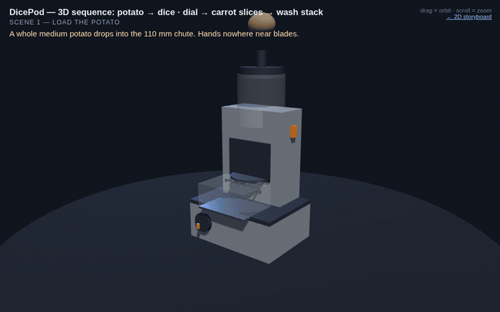
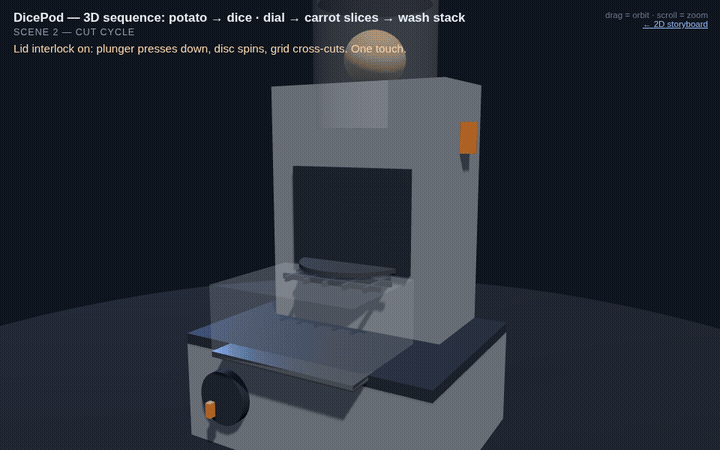
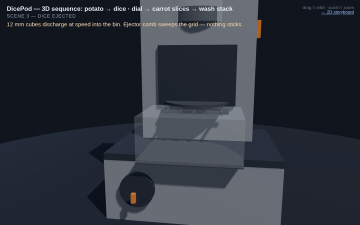
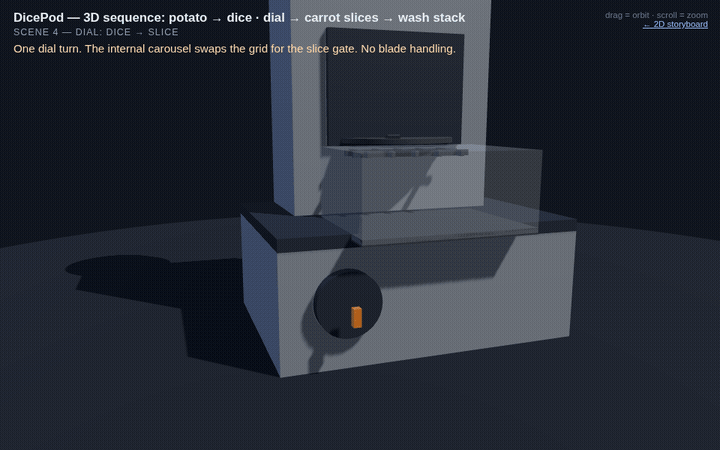
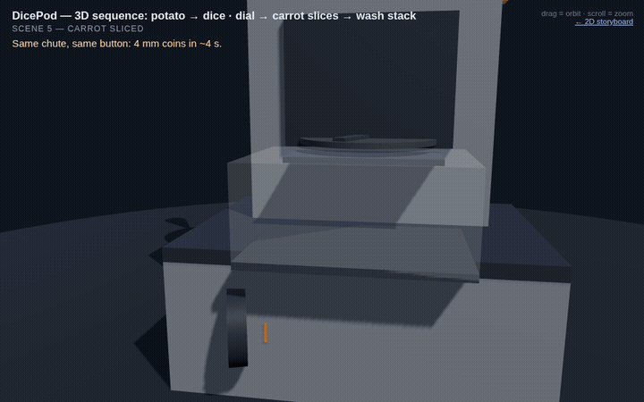
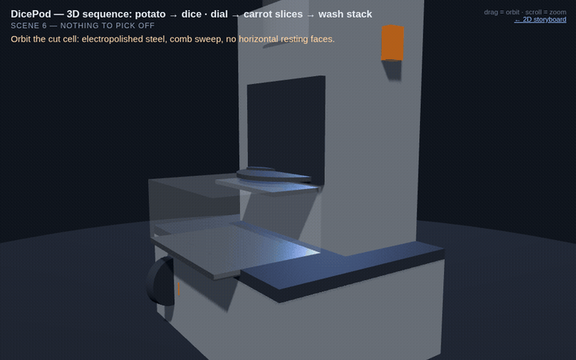
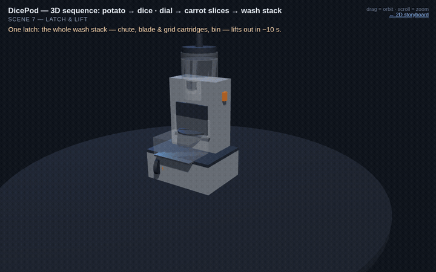
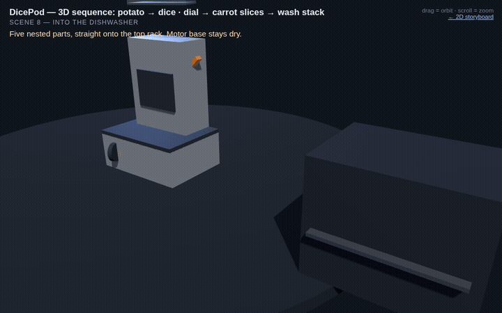

# DicePod — visual sequence & 3D mechanism

Research + visuals for a **$499 AUD consumer vegetable dicer/slicer** that meets every requirement (feeds up to a medium-large potato, nothing sticks to blades, Thermomix-sized, wash-stack out in ~10 s, faster than a knife, and the user never changes a blade).

**Verdict: feasible at $499 AUD** — every mechanism already exists in consumer/commercial products at or below this price; the one novel element is the internal motorised blade/grid carousel (the main engineering risk, with a de-scoped V1 identified).

---

## ▶ Watch the mechanism run (animated)

The clips below are the actual 3D model running — not stills.

**Scene 1 — Load the potato.** Whole medium potato drops into the 110 mm chute; hands nowhere near blades.

**Scene 2 — Cut cycle.** Lid interlock on: the pusher drives down while the disc spins and the grid cross-cuts. One touch, ~5 s.

**Scene 3 — Dice ejected.** 12 mm cubes discharge at speed into the bin; the green ejector comb sweeps the grid every stroke so nothing sticks.

**Scene 4 — Dial: Dice → Slice.** The sealed dial rotates and the internal carousel swaps the grid for the slice gate. The user never touches a blade.

**Scene 5 — Carrot sliced.** Same chute, same button — 4 mm coins in ~4 s.

**Scene 6 — Nothing to pick off.** Orbit of the cut cell: electropolished steel, comb sweep, no horizontal resting faces.

**Scene 7 — Latch & lift.** One latch releases the whole wash stack (chute, blade & grid cartridges, bin) — out in ~10 s.

**Scene 8 — Into the dishwasher.** Five nested parts straight onto the top rack; the motor base stays dry.

---

## Files

| File | What it is |
|---|---|
| `index.html` | 2D storyboard: feasibility table + 8 illustrated scenes (open in any browser) |
| `model3d.html` | **Interactive 3D model** (Three.js, self-contained — just double-click). Play/pause, timeline scrubber, drag to orbit, scroll to zoom. Deep-link any moment with `#t=SECONDS` (e.g. `model3d.html#t=9`) |
| `rev-f/rev-f.html` | **Rev F kinematic prototype** — state-machine-driven sequence with shaped parts (tapered knife blades, cam lobes, hopper, drum magazines), interlock assertions and pattern selector. Self-contained; double-click to open. Source in `rev-f/src/`, rebuild with `node rev-f/scripts/build.mjs`, checks via `node --test rev-f/tests/` |
| `gifs/` | The animated clips embedded above, rendered from the 3D model |

## Requirement coverage

| Requirement | Verdict | How |
|---|---|---|
| Up to medium-large potato, cubed | ✅ | 110 mm class feed chute (Breville Paradice already does 120 mm) |
| $500 AUD end cost | ✅ | Comparable BOMs retail at $479–529 (Breville Paradice 9, KitchenAid dicing kit) |
| Nothing sticks to blades | ✅ | Ejector comb + high-speed discharge + electropolished steel, no horizontal ledges |
| Pot/Thermomix size | ✅ | 30×24×36 cm target (TM6 is ~34×33×33) |
| Wash stack out in 10–15 s | ✅ | One latch, 5 nested parts, top-rack dishwasher safe |
| No slower than a human | ✅ | ~3–10 s/item vs 30–120 s by knife |
| Dice sizes + slices, no user blade change | ⚠️ Feasible, hardest | Internal motorised carousel (8/12/20 mm grids + slice gate) driven by a sealed external dial |
